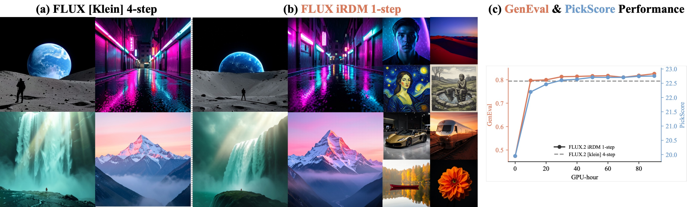

<div align="center">

# Representation Distribution Matching for One-Step Visual Generation

*One step from real.*

**Lan Feng**<sup>1</sup> &nbsp;·&nbsp; **Wuyang Li**<sup>1</sup> &nbsp;·&nbsp; **Éloi Zablocki**<sup>2</sup> &nbsp;·&nbsp; **Matthieu Cord**<sup>2,3</sup> &nbsp;·&nbsp; **Alexandre Alahi**<sup>1</sup>

<sup>1</sup>EPFL &nbsp;&nbsp;·&nbsp;&nbsp; <sup>2</sup>Valeo.ai &nbsp;&nbsp;·&nbsp;&nbsp; <sup>3</sup>Sorbonne Université

[](https://alan-lanfeng.github.io/rdm/)
[](https://arxiv.org/abs/2607.02375)
[](https://alan-lanfeng.github.io/rdm/RDM.pdf)
[](https://huggingface.co/spaces/epfl-vita/flux2-klein-1step-demo)
[](https://huggingface.co/epfl-vita/flux2-klein-1step-rdm)
[](LICENSE)

<br/>



<sub><em>iRDM post-trains four-step FLUX.2&nbsp;[klein] into a <b>one-step</b> generator at matched quality — one network evaluation, no iterative sampling.</em></sub>

</div>

---

Train a **one-step** image generator with **no online teacher, no adversary, no trajectory** by
matching generated and real feature distributions under a battery of frozen pretrained
encoders. iRDM combines the preferred choice on each of the two design axes of RDM:

- **Comparison** — a squared MMD with a Gaussian kernel on raw embeddings, estimated as an
  **exact within-batch repulsion** paired with a **Nyström attraction** toward a reference
  frozen once over the whole training set (eq. 3), fed by **large fresh generation batches**
  (gradient caching absorbs the memory), and — for text-to-image — the **joint image-text law**.
- **Representation** — a **battery of frozen encoders** (10 train + 4 held out), kept in
  balance by a **proportional Lagrangian controller**.

It sets the one-step ImageNet state of the art at **SW_r14 1.30**, and post-trains four-step
FLUX.2 [klein] into a one-step model that surpasses it on GenEval (0.826 vs 0.794).

## Install

```bash
pip install -e .            # torch, timm, open_clip, transformers, diffusers, ...
# DreamSim (held-in encoder, required for eval-imagenet): pip install dreamsim   (or: pip install -e .[encoders])
# FLUX.2 path also needs Black Forest Labs' `flux2` package (https://github.com/black-forest-labs/flux2 --
#   clone it and point FLUX2_SRC at its `src/`), the klein-4B + AE base weights, and a newer transformers
#   (separate env). See docs/flux_reference.md for the full FLUX.2 setup.
```

## Layout

```
rdm/compare/         the comparison axis: kernels, Nyström, the iRDM loss + the 6 ablation distances
rdm/representation/  the 14-encoder battery (Table 5), generators (pMF-H, FLUX.2), the joint feature
rdm/refprep/         the offline frozen reference precompute (the heavy one-time compute)
rdm/train/           the loop, gradient caching, the PID-Lagrangian controller
rdm/eval/            off-objective metrics: SW_r14 (primary), MMDr14, GenEval, PickScore
rdm/toy/             the spiral diagnostics (Fig. 3) and the batch / distance ablations
configs/  scripts/  tests/  reproduce.py
```

## Data

Datasets are never fetched for you — you point the pipeline at images already on disk. Only
the ImageNet path is needed for the headline ImageNet result.

- **ImageNet-256** — an `ImageFolder`-style tree (flat or class-nested) for train and val.
  Used only by the reference precompute and by evaluation, never by the training loop itself
  (which consumes the frozen banks). Pass the roots via `IMAGENET_TRAIN` / `IMAGENET_VAL`.
- **COCO** (FLUX text-to-image only) — download train2014, build the canonical pairing, then
  build the joint reference pack and the Qwen3 text context. The full pipeline (with commands)
  is in **`docs/flux_reference.md`**; everything except the image download is in-repo and
  runs on one GPU.
- **Eval-only prompt assets** (FLUX) — the GenEval (553) and Pick-a-Pic (499) prompts are
  **bundled** at `assets/geneval_prompts.jsonl` / `assets/pickapic_test_prompts.jsonl`
  (see `assets/README.md`); each prompt's FLUX.2 context is encoded on the fly at eval time.
  GenEval *scoring* also needs a local clone of the official scorer.

## Quickstart

```bash
# Self-contained spiral diagnostic (no data/weights): Fig. 3
python reproduce.py fig3 --smoke         # ~5 s wiring check; drop --smoke for the real figure

# Download the released pMF-H generator + warm the encoder cache
python scripts/download_checkpoints.py --pmfh --warm-encoders

# Build the frozen reference over your ImageNet roots (one-time, heavy), then sanity-check
IMAGENET_TRAIN=/data/imagenet/train IMAGENET_VAL=/data/imagenet/val bash scripts/run_refprep.sh
python scripts/check_artifacts.py configs/imagenet.yaml

# Post-train one-step ImageNet (8 GPU) and evaluate (SW_r14 + MMDr14 + off-objective PickScore)
GPUS=8 bash scripts/train.sh configs/imagenet.yaml
python reproduce.py eval-imagenet
```

## Released checkpoints

Two one-step generators are published; both are drop-in `load_from` checkpoints that the eval
configs already point at. **`docs/evaluating_released_checkpoints.md`** is the full download → score
recipe (env, the external GenEval scorer, the ImageNet eval banks, expected numbers).

> The released FLUX geALLcoco **s180** checkpoint scores **GenEval 0.826**; its reference mix is
> partly in-distribution (see the doc).
> The FLUX student weights are a derivative of FLUX.2 [klein]-4B (Apache-2.0). Both checkpoint
> repos are public; override with `--pmfh-repo` / `--flux-repo` if you re-host.

```bash
python scripts/download_checkpoints.py --flux    # FLUX.2 klein one-step student  -> GenEval + PickScore
python reproduce.py eval-flux                                      # GenEval axis   (ctx48)
python reproduce.py eval-flux --config configs/eval_flux_pspa.yaml # PickScore-pa   (ctx232)
python scripts/download_checkpoints.py --pmfh    # ImageNet-256 pMF-H generator -> SW_r14 + MMDr14 + PickScore
python reproduce.py eval-imagenet
```

| checkpoint | HF repo | access |
|---|---|---|
| FLUX.2 klein-4B one-step (geALLcoco s180) | [`epfl-vita/flux2-klein-1step-rdm`](https://huggingface.co/epfl-vita/flux2-klein-1step-rdm) | public |
| ImageNet-256 pMF-H FD-SIM (σ0.7, 4k) | [`Lanl11/pMF-H-FDSIM-imagenet256-sigma07-4k`](https://huggingface.co/Lanl11/pMF-H-FDSIM-imagenet256-sigma07-4k) | public |

## Evaluation is never the training objective

The primary metric **SW_r14** (Sliced-Wasserstein, eq. 5) shares no machinery with the
kernel MMD we train against, so a gain rules out reward hacking; `rdm/eval/` never imports the
training loss path (enforced by `tests/test_offobjective_floor.py`). Four of the fourteen
encoders are held out from training as a generalization check.

## Implementation notes

The paper and this release are consistent; the code is authoritative for exact values. A few
choices worth knowing:

1. **ImageNet learning rate `1.6e-6`** at N = 5120.
2. **The within-batch repulsion is the biased MMD²** — the `i = i` diagonal is included and the
   sum is divided by `N²` (not the unbiased off-diagonal U-statistic).
3. **The FLUX joint feature** concatenates each battery encoder's image feature with a frozen
   SigLIP2 **text** embedding τ(c): `Φ(x,c) = [φ(x) | β·τ(c)]` (the SigLIP image tower is not used).
4. **The Nyström attraction** ships in the precomputed-coefficient form `k_gr = mean_i k(g_i, Z)·α`
   with `α = K_ZZ⁻¹ μ̄` (algebraically equal to eq. 3's `ψ(g)ᵀμ̄`); the toy uses the explicit eigh
   `K_mm^{-1/2}` feature map.
5. **MMDr14 is the arithmetic mean** over the 14 encoders (iRDM 2.69).
6. The released **pMF-H FD-SIM** network (`rdm/representation/models/pmfh_fdsim.py`, MiT-H backbone)
   is vendored so the checkpoint loads; it is not retrained from scratch.

> **FLUX config:** `configs/flux.yaml` is the joint (concat) recipe and uses the **same training
> parameters as the marginal run** — only `joint_enable` differs (set `false` for the Table-2
> marginal ablation). `grad_accum` is the memory knob: keep `rollout_size` fixed and, on smaller
> GPUs, lower `batch_size` and raise `grad_accum` (`grad_accum = rollout_size / (batch_size × world_size)`).

## Citation

```bibtex
@article{feng2026irdm,
  title={Representation Distribution Matching for One-Step Visual Generation},
  author={Feng, Lan and Li, Wuyang and Zablocki, {\'E}loi and Cord, Matthieu and Alahi, Alexandre},
  journal={arXiv preprint arXiv:2607.02375},
  year={2026}
}
```

MIT (Copyright 2026 Lan Feng). Third-party vendored/referenced components (FD-Loss networks, the
tf-compat Inception encoder, FLUX.2) and their licenses are listed in `THIRD_PARTY.md`. See
`docs/reproduction_map.md` for the artifact → command → paper-table map and `docs/method_notes.md`
for the design log and pitfalls.
